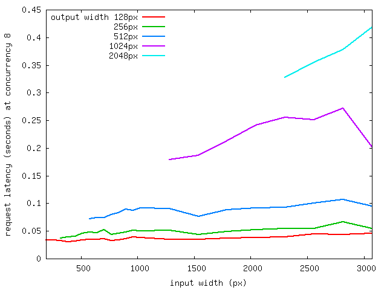
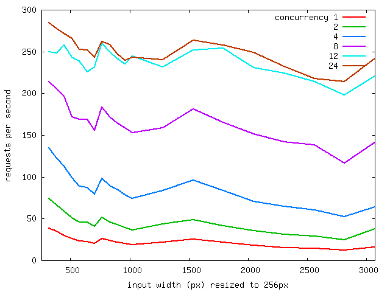
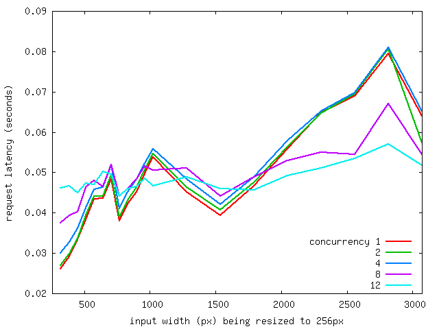

Benchmarks
==========

Repeatedly resizing a [large Wikipedia
image](https://upload.wikimedia.org/wikipedia/commons/a/a7/Rusty_long_construction_tubes_of_the_large_excavation_for_project_De_Hallen%2C_Amsterdam-West%2C_2014_-_Lange_stempels_in_de_bouwput_omringd_door_damwanden_-Hallen-project_in_de_Kinkerbuurt.jpg)
on a bare metal Linux server with dual Intel Xeon X5675 (12 physical cores),
we can get an idea of how fast Fotomat is at various resizing operations and
how well it performs under load.

While handling 8 concurrent requests, here's the throughput in requests per
second (y axis) when scaling variously sizes input images (x axis) and being
asked to scale to variously sizes output images (colored lines):

Latency in seconds (y axis) instead of throughput for the above:

While scaling down to a 256px output image, here's the throughput in requests per
second (y axis) when scaling variously sizes input images (x axis) at
varying request concurrencies (colored lines):

Latency in seconds (y axis) instead of throughput for the above:

Test Methology
--------------

To test this on your own hardware, you can install wrk and graphviz and use
Fotomat's benchmarking tools:

- [bench-server](images/bench-server) downloads the test image and pre-scales it to the test input sizes, then runs the server.
- [bench-client](images/bench-client) repeatedly runs wrk against Fotomat and parses the result into the TSV format that bench-graph wants. 
- [bench-graph](images/bench-graph) uses graphviz to generate graphs from the bench-client results.
